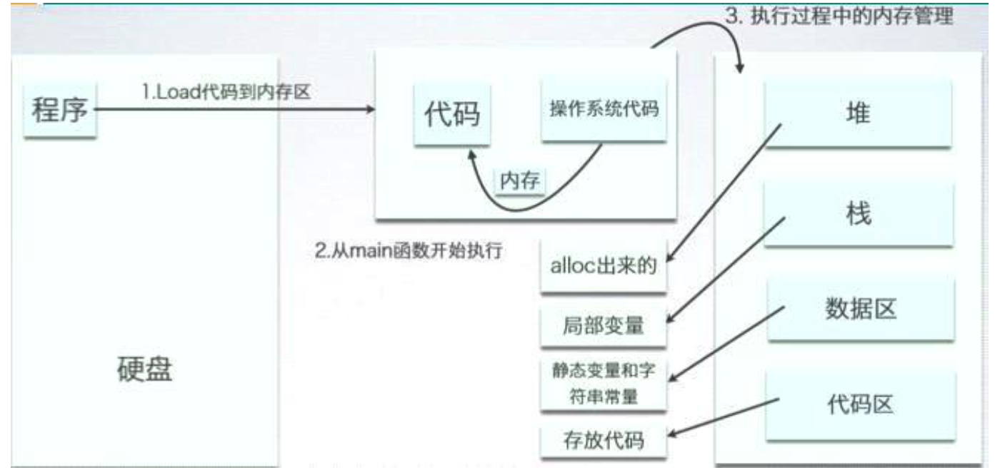
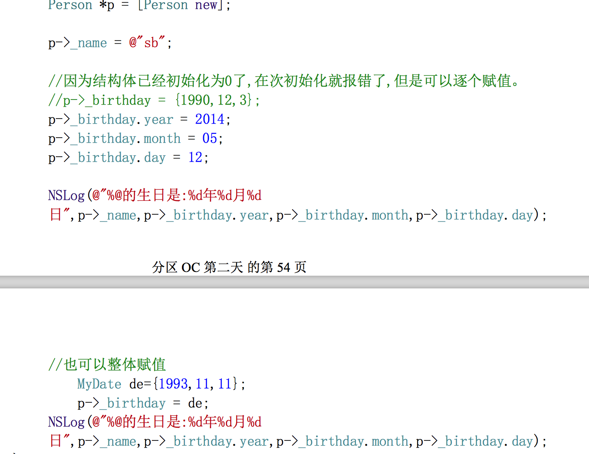

#### Objective-C是面向对象的语言（Dynamic Language）
	- Dynamic Binding动态绑定 
	- Dynamic Typing动态检查 
	- Dynamic Linking动态链接
	- 几乎所有的工作都可以在运行时处理

***
- 看到NS前缀就知道是Cocoa中的系统类的名称

***

- 面向对象
	- 类三个属性：类型、属性、行为
- 类、对象存储分析
	
	- 每一个对象都包含一个isa指针.这个指针指向当前对象所属的类。
	- [p eat];表示给p所指向的对象发送一条eat消息,调用对象的eat方法,此时对象会顺着内部的isa 指针找到存储于类中的方法,执行。
	- isa是对象中的隐藏指针,指向创建这个对象的类。
	
#### 结构体与类的区别
- 1)结构体变量存在栈里面，类实例化出来的对象存在堆里面 
- 2)结构体里面不能写函数，类里面可以写函数并且可以写方法 
- 3)结构体成员没有访问权限的说法，类的成员有@public @private @protected三种 
- 4)结构体不可以被继承，类可以(以后学) 
- 5)结构体的思想属于面向过程的思维，类是面向对象的产物(靠积累才能理解)
- 

#### 封装Setter Getter
- set get
- 点语法是编译器特性。点语法的本质是方法的调用,而不是访问成员变量,当使用点语法时,编译器会自动展开成相应的方法。
- 切记点语法的本质是转换成相应的set和get方法,如果没有set和get方法,则不能使用点语 法。
- @property
	 - @property是编译器的指令，@property 告诉编译器,声明属性的set、get方法.
	 - Xcode4.4以后property做了增强；自动生成get/set方法的声明、实现；
	 - **如果没有手动声明成员变量,property会在.m文件中自动帮我们生成一个_开头的成员变量**. 
	 - **如果set和get方法都是手动实现的,那么编译器将不会生成成员变量,并且报错。（需要手动声明_变量）**
	 - 注意点:如果想让子类继承父类的成员变量,还是必须在.h中手动写成员变量


#### OC一些细节
- OC中并没有重载，也即OC中的方法不能重名!
	- -(void)test; 
	- -(void)test:(int)num;
	- 如果写了这么两个方法，不会报错
- OC中static不能修饰成员变量，也不能修饰方法!
- 基类的私有属性能被继承,不能被使用
- OC中的继承是单继承
- self关键字: 
	- 谁调用当前方法，self就代表谁 
	- 在对象方法中，代表当前对象 
	- 在类方法中，代表类
- super关键字:
   - 显示地调用父类中的方法!
- 类对象
- SEL类型
- IMP（相当于函数指针）

### OC加强
- 1、动态类型检测
	- 2)在objective-c里,**对象不调用方法,而是接收消息**,消息表达式为: [reciver message];运行时系统首先确定接收者的类型(动态类型识别),然后根据消息名在类的方法列表里选择相依的方法执行,所以在源代码里消息也称为选择器SEL。
	- 3)消息函数的作用:
		- 首先通过第一个参数的receiver,找到它的isa 指针,然后在isa 指向的Class 对象中使用第二个参数SEL查找方法;
		- 如果没有找到,就使用当前Class 对象中的新的isa 指针 到上一级的父类的Class对象中查找;
		- 当找到方法后,再依据receiver的中的self指针找到当前的对象,调用当前对象的具体实现的方法(IMP),然后传递参数,调用实现方法。
		- 假如一直找到NSObject的Class对象,也没有找到你调用的方法,就会报告不能识别发送消息的错误。
- 2、动态类型检测方法

```
    1).判断对象是不是指定类的对象或者指定类的子类对象.
       - (BOOL)isKindOfClass:(Class)aClass;

    2).判断对象是不是1个特定类型的对象,不包括子类.
       - (BOOL)isMemberOfClass:(Class)aClass;

    3).判断1个类是不是另外1个类的子类.
       + (BOOL)isSubclassOfClass:(Class)aClass;

    4).判断对象中是否能响应指定的方法. 这个最常用.
       - (BOOL)respondsToSelector:(SEL)aSelector;

    5).判断类中是否能响应指定方法.
       +(BOOL)instancesRespondToSelector:(SEL)aSelector;
```
- 构造方法

#### OC内存管理
- 管理任何继承NSObject的对象，对其他的基本数据类型无效
- 本质原因：是因为对象和其他数据类型在系统中的存储空间不一样，其他局部变量主要存放于栈中，而对象存储于堆中。当代码块结束时，这个代码块中涉及的所有局部变量会被回收，指向对象的指针也被回收，此时，对象已经没有指针指向，但依然存在于内存中，造成内存泄露。
- 关于nil和Nil及NULL的区别:
	- 1.nil: A null pointer to an Objective-C object. ( #define nil ((id)0) )
```
nil 是一个对象值。
Person *p = [Person new];
p = nil;
```
	- 2.Nil: A null pointer to an Objective-C class.
		- 如:Class someClass = Nil;给类对象赋值
	- 3.NULL: A null pointer to anything else. ( #define NULL ((void *)0) )
		- NULL是一个通用指针(泛型指针)。
	- 4.NSNull: A class defines a singleton object used to represent null values in collection objects (which don't allow nil values).
		- [NSNull null]: The singleton instance of NSNull。
		- [NSNull null]是一个对象,他用在不能使用nil的场合。

#### block

#### protocol
- id和instancetype的区别
	- 1）instancetype只能作为函数或者方法的返回值
	- 2）id能作为方法或者参数的数据类型、返回值，也能用来定义变量。
	- 3）instancetype对比id的好处：能精确的限制返回值的具体类型。
	
#### NSString
