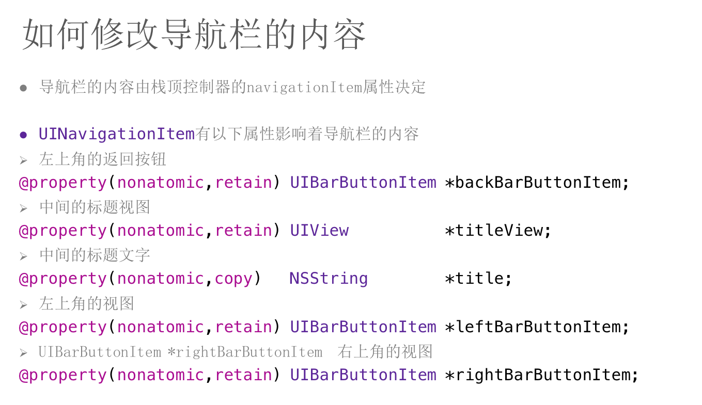

#####程序启动原理
- UIApplicationMain函数的作用
	- This function instantiates the application object from the principal class and instantiates the delegate (if any) from the given class and sets the delegate for the application. 
	- It also sets up the main event loop, including the application’s run loop, and begins processing events. 
	- If the application’s Info.plist file specifies a main nib file to be loaded, by including the NSMainNibFile key and a valid nib file name for the value, this function loads that nib file.

- Storyboard作用
	- A storyboard file is an Interface Builder archive containing the app’s view controllers, the connections between those view controllers and their immediate views, and the segues between view controllers. 
	- When this key is present, the main storyboard file is loaded automatically at launch time and its initial view controller installed in the app’s window.

#####控制器管理
- 创建一个控制器（三种方式）
	- 1、通过storyboard创建
	- 2、直接创建MJViewController *mj = [[MJViewController alloc] init];
	- 3、指定xib文件来创建 MJViewController *mj = [[MJViewController alloc] initWithNibName:@"MJViewController" bundle:nil];
- **控制器view**
	- 
	- 控制器的view是延迟加载的：用到时再加载
	- 可以用isViewLoaded方法判断一个UIViewController的view是否已经被加载
	- 控制器的view加载完毕就会调用viewDidLoad方法
	- 

#####多控制器（UINavigationController、UITabBarController）
#####UINavigationController
- 
- 
- 
- 
