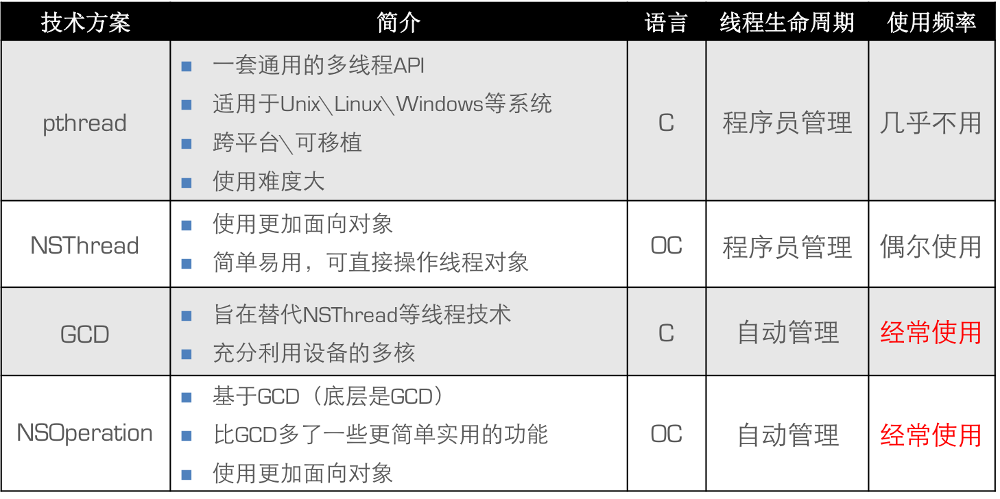

#####进程、线程
- 什么是进程
	- 进程是指在系统中正在运行的一个应用程序
	- 每个进程之间是独立的，每个进程均运行在其专用且受保护的内存空间内
- 什么是线程
	- 1个进程要想执行任务，必须得有线程（**每1个进程至少要有1条线程**）
	- **线程是进程的基本执行单元**，一个进程（程序）的所有任务都在线程中执行
- 线程的串行
	- 1个线程中任务的执行是**串行**的
	- 如果要在1个线程中执行多个任务，那么只能一个一个地按顺序执行这些任务
	- 也就是说，在同一时间内，1个线程只能执行1个任务
- 什么是多线程
	- 1个进程中可以开启多条线程，每条线程可以**并行（同时）**执行不同的任务
- 多线程的优点
	- 能适当提高程序的执行效率
	- 能适当提高资源利用率（CPU、内存利用率）
- 多线程的缺点
	- 开启线程需要占用一定的内存空间（默认情况下，主线程占用1M，子线程占用512KB），如果开启大量的线程，会占用大量的内存空间，降低程序的性能
	- 线程越多，CPU在调度线程上的开销就越大
	- 程序设计更加复杂：比如线程之间的通信、多线程的数据共享

#####多线程在iOS开发中的应用
- 什么是主线程
	- 一个iOS程序运行后，默认会开启1条线程，称为“主线程”或“UI线程”
- 主线程的主要作用
	- 显示\刷新UI界面
	- 处理UI事件（比如点击事件、滚动事件、拖拽事件等）
- 主线程的使用注意
	- 别将比较耗时的操作放到主线程中
	- 耗时操作会卡住主线程，严重影响UI的流畅度，给用户一种“卡”的坏体验
- iOS中多线程的实现方案
	- 

#####NSThread
- 


